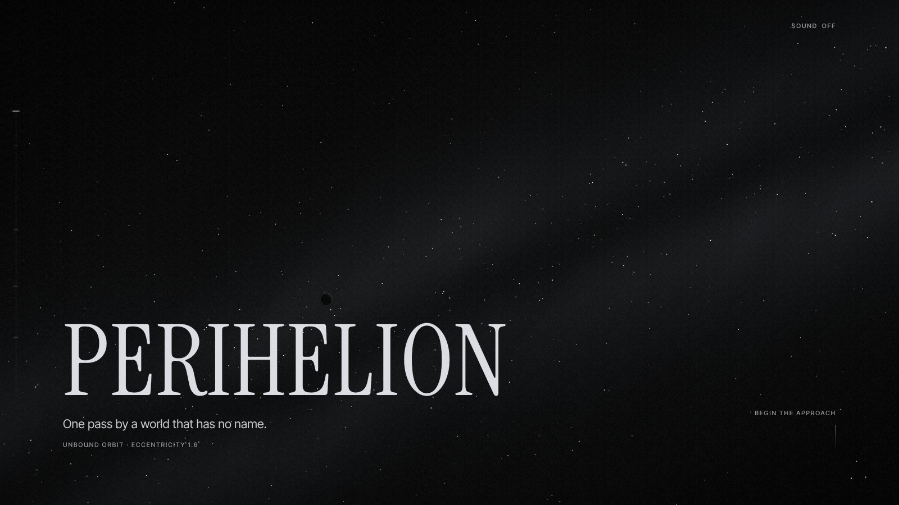
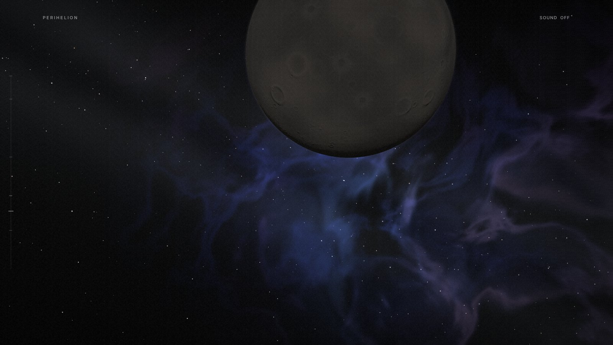
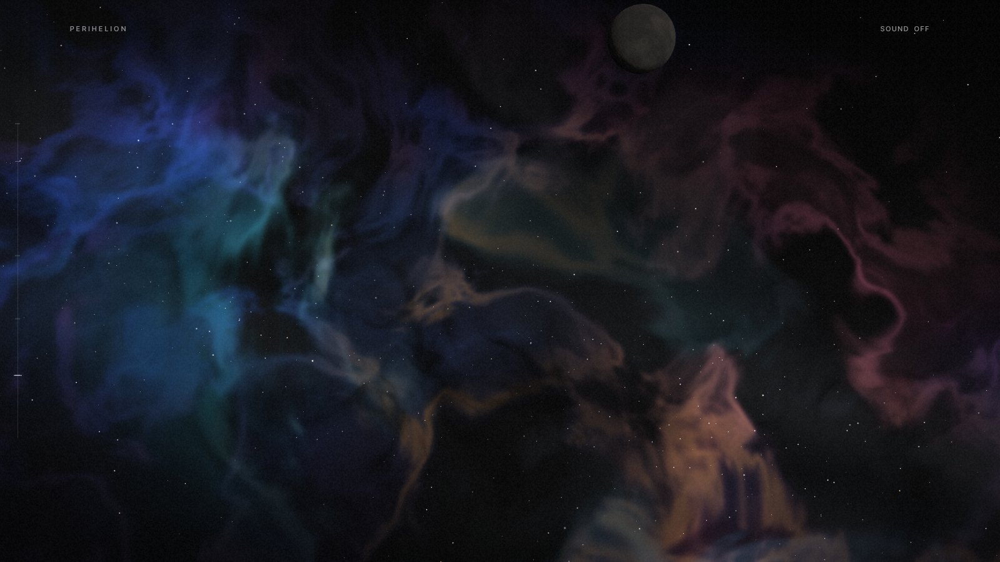

# Perihelion

One pass by a planet on an open orbit, told through scrolling.

You start about a million and a half kilometres out, where the planet is just
a dark dot against the galaxy. Scroll, and you fall in over its night side,
round the closest point about 9,800 km above the surface, and come out the
other side into a star-forming cloud. The orbit is hyperbolic (e = 1.6), so
there's no loop back. The last line says as much.







## Running it

```sh
npm install
npm run dev        # http://localhost:3000
```

For a production build:

```sh
npm run build
npm start
```

`npm run typecheck` runs `tsc` with no output.

You'll need a browser with WebGL 2. Everything is generated in code and
shaders at load time. There are no textures, models or audio files to fetch.

## How it works

Scroll position maps to a single number, `t`, from 0 to 1. Everything else
reads from it: where the camera is on the trajectory, which way it looks, how
much of the cloud has appeared, and which line of text is showing. Lenis
smooths the scrolling, and a zustand store holds `t`.

The flight is split into five movements: far field, ingress, the fold, egress
and drift. The indicator on the left names them, and you can jump between
them. They're only for finding your way. The camera never cuts between them.

Some details:

- **Trajectory.** A real hyperbola around the planet, at real scale (1 scene
  unit ≈ 1,638 km). The numbers in the narration come from the model rather
  than being written in. See `src/journey/trajectory.ts` and `script.ts`.
- **Gravitational lensing.** The starfield and the galactic band bend around
  the planet as you get close. It's done per pixel in the sky shaders rather
  than as a post-process, so stars behind the limb are actually displaced
  instead of smeared. See `src/scene/gravity/`.
- **Planet surface.** Craters, ridges and colour variation are baked once into
  a render target when the page loads. The terminator gets ragged near
  closest approach, where the horizon dips and mountains catch the light
  first.
- **The cloud.** A stack of dust slices plus two emission layers, composited
  front to back. It also has a few hundred young stars at different depths,
  so you get parallax through it. It starts to show as a faint blue-violet
  around t = 0.62 and fills the frame by the end. See
  `src/scene/world/cloud/`.
- **Sound.** Off by default, with a toggle in the top right. It's all Web
  Audio: a few detuned oscillators, filtered noise and a small feedback-delay
  reverb, all driven from `t`. See `src/audio/soundscape.ts`.
- **Text.** Most lines are ordinary DOM text over the canvas. One is drawn
  inside the 3D scene, so the planet passes in front of it. A DOM copy stays
  for screen readers.

The render loop runs `Driver`, then `CameraRig`, then `UiDriver`, once per
frame. The DOM overlays and the audio update from that same tick instead of
running their own `requestAnimationFrame`s.

## Performance

The target was a sustained 60 fps while scrolling on an Intel HD 620, a fairly
weak laptop GPU. A few things got it there:

- Anything that doesn't change from frame to frame is computed once at load
  and cached in a texture: the planet surface, the cloud density, the nebula
  colour and the galactic band.
- The film grain is drawn inside the WebGL frame. It used to be a CSS layer
  with a blend mode, and the browser's compositing of that layer cost more
  than the whole 3D scene.
- The cloud shader skips pixels that are empty.

Measured on the HD 620 while actually scrolling, the production build runs at
about 56–60 fps throughout. Renders timed in isolation don't catch
compositing costs like the grain layer, so they aren't a good measure here.

One thing hasn't been tested: high-DPI screens with scaling around 2×. The
canvas caps its pixel ratio at 1.75, but on a weak GPU that may still be too
much.

## Accessibility

- With `prefers-reduced-motion`, the grain holds still and jumps between
  movements happen without the long travel.
- You can move through the whole thing with the keyboard (Page Down, End,
  Tab to "Begin again").
- The narration exists as real text, not only as pixels in the canvas.

## Project layout

```
app/                 Next.js app router entry, global CSS, favicon
src/journey/         t, the trajectory, the script, environment curves
src/scene/           the R3F scene: camera rig, planet, sky, cloud, lensing, grain
src/ui/              overlays: opening, narration, indicator, sound toggle
src/audio/           the soundscape
src/lib/scroll/      Lenis setup
src/dev/             scrub panel and debug handles (development builds only)
```

The scrub panel in `src/dev/` shows up only under `next dev`. It lets you drag
`t` directly, and `window.__perihelion` in the console gives you seek and
layer toggles. Both are stripped from production builds.

## Stack

Next.js 16, React 19, React Three Fiber 9, three.js r186, Lenis and zustand.
Written in TypeScript.
